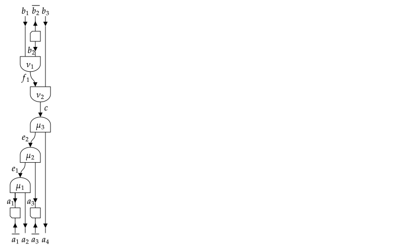
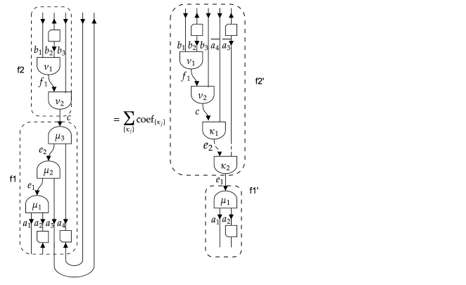
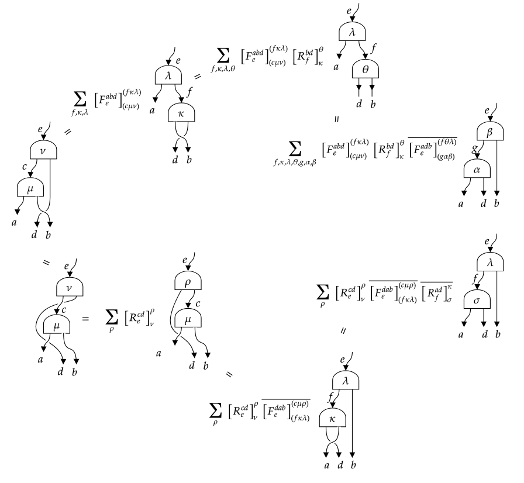

# [Sectors, representation spaces and fusion trees](@id s_sectorsrepfusion)

```@setup sectors
using TensorXD
import LinearAlgebra.I
```
### Types
```julia
# General Sector
abstract type Sector end
struct SectorValues{I<:Sector} end  # Singleton type to represent an iterator over the possible values of type `I`, whose instance is obtained as `values(I)`.
const SectorDict{K, V} = SortedVectorDict{K, V}

abstract type FusionStyle end
struct UniqueFusion <: FusionStyle end # unique fusion output when fusion two sectors
abstract type MultipleFusion <: FusionStyle end
struct SimpleFusion <: MultipleFusion end # multiple fusion but multiplicity free
struct GenericFusion <: MultipleFusion end # multiple fusion with multiplicities
const MultiplicityFreeFusion = Union{UniqueFusion, SimpleFusion}

abstract type BraidingStyle end # generic braiding
abstract type HasBraiding <: BraidingStyle end
struct NoBraiding <: BraidingStyle end
abstract type SymmetricBraiding <: HasBraiding end # symmetric braiding => actions of permutation group are well defined
struct Bosonic <: SymmetricBraiding end # all twists are one
struct Fermionic <: SymmetricBraiding end # twists one and minus one
struct Anyonic <: HasBraiding end

struct Trivial <: Sector end

# Anyon category
struct FibonacciAnyon <: Sector
    isone::Bool
    function FibonacciAnyon(s::Symbol)
        s in (:I, :τ, :tau) || throw(ArgumentError("Unknown FibonacciAnyon $s."))
        new(s === :I)
    end
end
const _goldenratio = Float64(MathConstants.golden)

struct IsingAnyon <: Sector
    s::Symbol
    function IsingAnyon(s::Symbol)
        s == :sigma && (s = :σ)
        s == :psi && (s = :ψ)
        if !(s in (:I, :σ, :ψ))
            throw(ValueError("Unknown IsingAnyon $s."))
        end
        new(s)
    end
end
const all_isinganyons = (IsingAnyon(:I), IsingAnyon(:σ), IsingAnyon(:ψ))

# Group
abstract type Group end
abstract type AbelianGroup <: Group end

abstract type ℤ{N} <: AbelianGroup end
abstract type U₁ <: AbelianGroup end
abstract type SU{N} <: Group end
abstract type CU₁ <: Group end

const ℤ₂ = ℤ{2}
const ℤ₃ = ℤ{3}
const ℤ₄ = ℤ{4}
const SU₂ = SU{2}

const GroupTuple = Tuple{Vararg{Group}}
abstract type ProductGroup{T<:GroupTuple} <: Group end

# Rep_G category
abstract type AbstractIrrep{G<:Group} <: Sector end # irreps have integer quantum dimensions
struct IrrepTable end
const Irrep = IrrepTable()

const AbelianIrrep{G} = AbstractIrrep{G} where {G<:AbelianGroup}

struct ZNIrrep{N} <: AbstractIrrep{ℤ{N}}
    n::Int8
    function ZNIrrep{N}(n::Integer) where {N}
        @assert N < 64
        new{N}(mod(n, N))
    end
end
Base.getindex(::IrrepTable, ::Type{ℤ{N}}) where N = ZNIrrep{N} # Irrep[Z{N}] = ZNIrrep{N}
const Z2Irrep = ZNIrrep{2}
const Z3Irrep = ZNIrrep{3}
const Z4Irrep = ZNIrrep{4}

struct U1Irrep <: AbstractIrrep{U₁}
    charge::HalfInt
end

struct SU2IrrepException <: Exception end
struct SU2Irrep <: AbstractIrrep{SU₂}
    j::HalfInt
    function SU2Irrep(j)
        j >= zero(j) || error("Not a valid SU₂ irrep")
        new(j)
    end
end
const _su2one = SU2Irrep(zero(HalfInt))

struct CU1Irrep <: AbstractIrrep{CU₁}
    j::HalfInt # value of the U1 charge
    s::Int # rep of charge conjugation:
    # if j == 0, s = 0 (trivial) or s = 1 (non-trivial),
    # else s = 2 (two-dimensional representation)
    # Let constructor take the actual half integer value j
    function CU1Irrep(j::Real, s::Integer = ifelse(j>zero(j), 2, 0))
        if ((j > zero(j) && s == 2) || (j == zero(j) && (s == 0 || s == 1)))
            new(j, s)
        else
            error("Not a valid CU₁ irrep")
        end
    end
end

# Fusion Trees
struct FusionTree{I<:Sector, N, M, L, T} # a splitting tree of simple objects
    uncoupled::NTuple{N, I} # objects coming out of the splitting trees, before the possible ``Z`` isomorphism.
    coupled::I
    isdual::NTuple{N, Bool}
    innerlines::NTuple{M, I} # M = N-2
    vertices::NTuple{L, T} # L = N-1
    function FusionTree{I, N, M, L, T}(uncoupled::NTuple{N, I},
                                            coupled::I,
                                            isdual::NTuple{N, Bool},
                                            innerlines::NTuple{M, I},
                                            vertices::NTuple{L, T}) where
                                            {I<:Sector, N, M, L, T}
        new{I, N, M, L, T}(uncoupled, coupled, isdual, innerlines, vertices)
    end
end

struct FusionTreeIterator{I<:Sector, N}
    uncoupled::NTuple{N, I}
    coupled::I
    isdual::NTuple{N, Bool}
end # iterate over fusion trees for fixed coupled and uncoupled sector labels

fusiontreedict(I) = FusionStyle(I) isa UniqueFusion ? SingletonDict : FusionTreeDict
const FusionTreeDict{K, V} = Dict{K, V}

const transposecache = LRU{Any, Any}(; maxsize = 10^5)
const usetransposecache = Ref{Bool}(true)
const TransposeKey{I<:Sector, N₁, N₂} = Tuple{<:FusionTree{I}, <:FusionTree{I},
                                                IndexTuple{N₁}, IndexTuple{N₂}}

const braidcache = LRU{Any, Any}(; maxsize = 10^5)
const usebraidcache_abelian = Ref{Bool}(false)
const usebraidcache_nonabelian = Ref{Bool}(true)    

const BraidKey{I<:Sector, N₁, N₂} = Tuple{<:FusionTree{I}, <:FusionTree{I},
                                        IndexTuple, IndexTuple,
                                        IndexTuple{N₁}, IndexTuple{N₂}}                                            
```
### Properties
#### Sectors
```julia
Base.values(::Type{I}) where {I<:Sector} # Return the iterator that generate all simple objects of sector `I`.
Base.one(a::Sector) = one(typeof(a)) # Return the unit object of the sector.
dual(a::Sector) = conj(a)
Base.conj # Return `a̅`; this should be implemented
Base.isless # give a canonical order for the simple objects in a sector
FusionStyle(a::Sector) = FusionStyle(typeof(a))
fusiontensor(a::I, b::I, c::I) where {I<:AbstractIrrep{G<:Group}} # Return the fusiontensor ``X^{ab}_{c,μ}: c → a ⊗ b`` as a rank-4 tensor with size `(dim(a),dim(b),dim(c),Int(Nsymbol(a,b,c)))`.
⊗(a::I, b::I) where {I<:Sector}  # Return an iterator of elements of `c::I` that appear in the fusion product `a ⊗ b`.
Nsymbol(a::I, b::I, c::I) where {I<:Sector} -> Integer # Return an `Integer` representing the number of times `c` appears in the fusion product `a ⊗ b`. Could be a `Bool` if `FusionStyle(I) == UniqueFusion()` or `SimpleFusion()`.
Fsymbol(a::I, b::I, c::I, d::I, e::I, f::I) where {I<:Sector} # Fsymbol(a,b,c,d,e,f)[μ,ν,κ,λ]
vertex_ind2label(k::Int, a::I, b::I, c::I) where {I<:Sector} # Convert the index `k` of the fusion vertex (a,b)->c into a label.
vertex_labeltype(I::Type{<:Sector}) -> Type # Return the type of labels for the fusion vertices of sectors of type `I`.
dim(a::Sector) # Return the (quantum) dimension of the sector `a`.
sqrtdim(a::Sector) # the square root of the quantum dimension of the sector `a`.
isqrtdim(a::Sector) # inverse of `sqrtdim(a::Sector)`
frobeniusschur(a::Sector) # Return the Frobenius-Schur indicator of a sector `a`.
Bsymbol(a::I, b::I, c::I) where {I<:Sector}
Asymbol(a::I, b::I, c::I) where {I<:Sector}
BraidingStyle(a::Sector) = BraidingStyle(typeof(a))
Rsymbol(a::I, b::I, c::I) where {I<:Sector}
twist(a::Sector)
Base.isreal(I::Type{<:Sector}) # whether topological data real
×(a::Type{<:Group}, b::Type{<:Group}, c::Type{<:Group}...) = ×(×(a, b), c...) # Product of Groups
```
#### Fusion trees
```julia
fusiontreetype(::Type{I}, N::Int) where {I<:Sector}  # Return the correct fusiontree type `FusionTree{I<:Sector, N, M, L, T}` based on `I` and `N`.
sectortype(::Type{<:FusionTree{I}}) # also for instance
FusionStyle(::Type{<:FusionTree{I}}) where {I<:Sector} # also for instance
BraidingStyle(::Type{<:FusionTree{I}}) where {I<:Sector} # also for instance
Base.length(::Type{<:FusionTree{<:Sector, N}}) where {N} # Return the number of the uncoupled objects in a fusion tree; also for instance
Base.isequal(f1::FusionTree{I, N}, f2::FusionTree{I, N}) where {I<:Sector, N}
fusiontrees(uncoupled::NTuple{N, I}, coupled::I = one(I), isdual::NTuple{N, Bool} = ntuple(n->false, Val(N))) where {N, I<:Sector} # return the FusionTreeIterator over all possible fusion trees from a set of N uncoupled sectors to a given coupled sector
Base.length(iter::FusionTreeIterator) # number of fusiontrees with fixed uncoupled objects and coupled object

 # Planar manipulations on a splitting tree
split(f::FusionTree{I, N}, M::Int) # Split a fusion tree into two. The first tree has as uncoupled sectors the first `M` uncoupled sectors of the input tree `f`
insertat(f::FusionTree{I, N₁}, i::Int, f2::FusionTree{I, N₂}) # Attach a fusion tree `f2` to the uncoupled leg `i` of the fusion tree `f1` and bring it into a linear combination of fusion trees in standard form.
merge(f1::FusionTree{I, N₁}, f2::FusionTree{I, N₂}, c::I, μ = nothing) # Merge two fusion trees together to a linear combination of fusion trees whose uncoupled sectors are those of `f1` followed by those of `f2`, and where the two coupled sectors of `f1` and `f2` are further fused to `c`.
elementary_trace(f::FusionTree{I, N}, i) where {I<:Sector, N} # Trace the ``i``th and ``i+1``th uncoupled sectors of splitting tree `f`.
planar_trace(f::FusionTree{I,N}, q1::IndexTuple{N₃}, q2::IndexTuple{N₃}) where {I<:Sector, N, N₃} # Take the traces between `q1[k]`th and `q2[k]`th sector of the splitting tree `f`, where `1<=k<=N₃`.

# Planar manipulations on a fusion-splitting tree
bendright(f1::FusionTree{I, N₁}, f2::FusionTree{I, N₂}) where {I<:Sector, N₁, N₂} # map final splitting vertex (a, b)<-c to fusion vertex a<-(c, dual(b))
bendleft(f1::FusionTree{I}, f2::FusionTree{I}) where I # map final fusion vertex c<-(a, b) to splitting vertex (c, dual(b))<-a
foldright(f1::FusionTree{I, N₁}, f2::FusionTree{I, N₂}) where {I<:Sector, N₁, N₂} # map first splitting vertex (a, b)<-c to fusion vertex b<-(dual(a), c)
foldleft(f1::FusionTree{I}, f2::FusionTree{I}) where I # map first fusion vertex c<-(a, b) to splitting vertex (dual(a), c)<-b
cycleclockwise(f1::FusionTree{I}, f2::FusionTree{I}) where {I<:Sector} # clockwise cyclic permutation while preserving (N₁, N₂): foldright & bendleft
cycleanticlockwise(f1::FusionTree{I}, f2::FusionTree{I}) where {I<:Sector} # anticlockwise cyclic permutation while preserving (N₁, N₂): foldleft & bendright
repartition(f1::FusionTree{I, N₁}, f2::FusionTree{I, N₂}, N::Int) where {I, N₁, N₂} # new tree has N outgoing sectors
Base.transpose(f1::FusionTree{I}, f2::FusionTree{I}, p1::IndexTuple{N₁}, p2::IndexTuple{N₂}) where {I<:Sector, N₁, N₂} # Computes new trees and corresponding coefficients obtained from repartitioning and cyclic permutating the fusion-splitting tree such that sectors `p1` become outgoing and sectors `p2` become incoming.
planar_trace(f1::FusionTree{I}, f2::FusionTree{I}, p1::IndexTuple{N₁}, p2::IndexTuple{N₂}, q1::IndexTuple{N₃}, q2::IndexTuple{N₃}) where {I<:Sector, N₁, N₂, N₃} # Take the traces between `q1[k]`th and `q2[k]`th sector of the fusion-splitting tree and the result is transposed according to `p1` and `p2`.

# Braiding manipulations on a splitting tree
artin_braid(f::FusionTree, i; inv::Bool = false) # Perform an elementary braid (Artin generator) of neighbouring uncoupled indices `i` and `i+1` on a fusion tree `f`, and returns the result as a dictionary of output trees and corresponding coefficients.
braid(f::FusionTree{<:Sector, N}, levels::NTuple{N, Int}, p::NTuple{N, Int}) # general braiding according to permutation p and levels
permute(f::FusionTree, p::NTuple{N, Int}) # permutation when braiding is symmetric

# Braiding manipulations on a fusion-splitting tree
braid(f1::FusionTree{I}, f2::FusionTree{I}, levels1::IndexTuple, levels2::IndexTuple, p1::IndexTuple{N₁}, p2::IndexTuple{N₂}) where {I<:Sector, N₁, N₂} # Compute new trees and corresponding coefficients obtained from repartitioning and braiding the tree such that sectors `p1` become outgoing and sectors `p2` become incoming.
permute(f1::FusionTree{I}, f2::FusionTree{I}, p1::NTuple{N₁, Int}, p2::NTuple{N₂, Int}) where {I, N₁, N₂} # permutation when braiding is symmetric
```
### Others structures
```julia
struct SectorSet{I<:Sector, F, S} # behaves as an iterator that applies x->convert(I, f(x)) on the elements of set; if f is not provided it is just taken as the function identity.
    f::F
    set::S
end
```

## [General arguments](@id ss_general)
Symmetries in a physical system often result in tensors which are invariant under the action
of the symmetry group, where this group acts as a tensor product of group actions on every
tensor index separately. The group action on a single index, or thus, on the corresponding
vector space, can be decomposed into irreducible representations (irreps). Here, we
restrict to unitary representations, such that the corresponding vector spaces also have a
natural Euclidean inner product. The Euclidean inner product between two
vectors is invariant under the group action and thus transforms according to the trivial
representation of the group.

The corresponding vector spaces will be canonically represented as
``V = ⨁_a ℂ^{n_a} ⊗ R_{a}``, where ``a`` labels the different irreps, ``n_a`` is the number
of times irrep ``a`` appears and ``R_a`` is the vector space associated with irrep ``a``.
Irreps are also known as spin sectors (in the case of ``\mathsf{SU}_2``) or charge sectors
(in the case of ``\mathsf{U}_1``), and we henceforth refer to ``a`` as a sector. For
practical reasons, we assume that there is a canonical order of the sectors, so that the
vector space ``V`` is completely specified by the values of ``n_a``.

As discussed in the section on [categories](@ref s_categories),
the approach we follow does go beyond the case of irreps of groups, and sectors
would more generally correspond to simple objects in a unitary ribbon fusion category.
Nonetheless, every step can be appreciated by using the representation theory of
``\mathsf{SU}_2`` or ``\mathsf{SU}_3`` as example.

The gain in efficiency (both in memory occupation and computation time) obtained from using
equivariant tensor maps is that, by Schur's lemma, they are block diagonal in
the basis of coupled sectors. To exploit this block diagonal form, it is essential
that we know the basis transform from the individual uncoupled sectors appearing in the
tensor product form of the domain and codomain, to the coupled sectors that label the
different blocks. We refer to the coupled sectors as block sectors. The transformation
from the uncoupled sectors to the block sector is encoded in a fusion tree (or splitting
tree). Essentially, it is a sequential application of pairwise fusion as described by the
group's Clebsch–Gordan (CG) coefficients. However, it turns out that we do not need the
actual CG coefficients, but only how they transform under transformations such as
interchanging the order of the incoming irreps or interchanging incoming and outgoing
irreps. This information is known as the topological data of the group, i.e. mainly the
F-symbols, which are also known as recoupling coefficients or 6j-symbols.
The F-symbol is actually Racah's W-coefficients in the case of ``\mathsf{SU}_2``.

Below, we describe how to specify a certain type of sector and what information about them
needs to be implemented. Then, we describe how to build a space ``V`` composed of a direct
sum of different sectors. Then, we explain the constructions and manipulations of fusion
trees. Finally, we elaborate on the case of general fusion categories and the possibility of
having fermionic or anyonic twists.

## [Representation theory and unitary fusion categories](@id ss_representationtheory)

Let us labol the sectors as ``a``, ``b``, ``c``, …. In general, they correspond to the
simple objects of a tensor category.

First, we need to specify the **fusion rules** ``a ⊗ b = ⨁ N^{ab}_{c} c`` with
``N^{ab}_{c}`` some non-negative integers.

There should always exists a unique trivial sector ``u`` (called the identity object ``I``
or ``1`` in the language of categories) such that ``a ⊗ u = a = u ⊗ a``.

We need to specify a unique sector ``\bar{a}`` such that ``N^{a\bar{a}}_{u} = 1``, whereas
for all ``b \neq \bar{a}``, ``N^{ab}_{u} = 0``. For unitary irreps of groups, ``\bar{a}``
corresponds to the complex conjugate of the representation ``a``, or a representation
isomorphic to it.

For example, for ``\mathsf{SU}_2``, the trivial sector corresponds to spin zero and all
irreps are self-dual (i.e. ``a = \bar{a}``), meaning that the conjugate representation is
isomorphic to the non-conjugated one (they are not equal but related by a similarity
transform).

The space of transformations ``R_c → R_a ⊗ R_b`` has dimension ``N^{ab}_c``. We assume there
exists a set of maps ``X^{ab}_{c,μ} : R_c → R_a ⊗ R_b`` with ``μ = 1, …, N^{ab}_c``, which
form the basis of the morphism space from ``R_c`` to ``R_a ⊗ R_b``, and satisfy

``(X^{ab}_{c,μ})^†\circ X^{ab}_{c,ν} = δ_{μ,ν} \mathrm{id}_{R_c}``

``\sum_{c} \sum_{μ = 1}^{N^{ab}_c} X^{ab}_{c,μ}\circ (X^{ab}_{c,μ})^\dagger = \mathrm{id}_{R_a ⊗ R_b}``

The tensors ``X^{ab}_{c,μ}`` are the splitting tensors, and their hermitian conjugate are
the fusion tensors. They are only determined up to a unitary basis transform within the
space, i.e., acting on the multiplicity label ``μ = 1, …, N^{ab}_c``. For ``\mathsf{SU}_2``,
``N^{ab}_c`` is zero or one and the entries of ``X^{ab}_{c}`` are precisely given by the CG
coefficients.

The topological data of category describes the following transformation:

*   F-move or recoupling: the transformation from ``(R_a ⊗ R_b) ⊗ R_c`` to
    ``R_a ⊗ (R_b ⊗ R_c)``:

    ``(X^{ab}_{e,μ} ⊗ \mathrm{id}_c) ∘ X^{ec}_{d,ν} = ∑_{f,κ,λ} [F^{abc}_{d}]_{eμν}^{fκλ} (\mathrm{id}_a ⊗ X^{bc}_{f,κ}) ∘ X^{af}_{d,λ}``

*   Braiding ``τ_{a,b}: R_a ⊗ R_b → R_b ⊗ R_a``:

    ``τ_{a,b} ∘ X^{ab}_{c,μ} = ∑_{ν} [R^{ab}_c]^ν_μ X^{ba}_{c,ν}``

The dimensions of the spaces ``R_a`` on which representation ``a`` acts are denoted as
``d_a`` and referred to as quantum dimensions. In particular, ``d_u = 1`` and
``d_a = d_{\bar{a}}``. This information is also encoded in the F-symbol as
``d_a = | [F^{a \bar{a} a}_a]^u_u |^{-1}``. Note that there are no multiplicity labels
in this particular F-symbol as ``N^{a\bar{a}}_u = 1``.

Graphically:


For the implementation, it will be useful to distinguish between the number of
different possibilities regarding the fusion rules. If, for every ``a`` and ``b``, there is
a **unique** ``c`` such that ``a ⊗ b = c`` (i.e. ``N^{ab}_{c} = 1`` and ``N^{ab}_{c′} = 0``
for all other ``c′``), the category is abelian. The representations of a group have this
property if and only if the group multiplication law is commutative. In this case, all
spaces ``R_{a}`` associated with the representation are one-dimensional and thus trivial. In
all other cases, the category is non-abelian. We find it useful to further distinguish
between categories which have all ``N^{ab}_c`` equal to zero or one (such that no
multiplicity labels are needed), e.g. the representations of ``\mathsf{SU}_2``, and those
where some ``N^{ab}_c`` are larger than one, e.g. the representations of ``\mathsf{SU}_3``.

## [Sectors](@id ss_sectors)

We introduce an abstract type to represent sectors
```julia
abstract type Sector end
```
Any concrete subtype of `Sector` should be such that its instances represent a consistent
set of sectors, corresponding to the irreps of a group, or, more generally, the simple
objects of an unitary fusion category.

Throughout TensorXD.jl, the method `sectortype` can be used to query the subtype of `Sector`
associated with an object, e.g., a vector space, fusion tree, tensor map, or a sector. It
works on both instances and types.

The data that needed to specify a sector type are:

*   the fusion rules `` a ⊗ b = ⨁ N^{ab}_{c} c ``: [`Nsymbol(a,b,c)`](@ref)
*   the list of fusion outputs from ``a ⊗ b``: while this information is contained in
    ``N^{ab}_c``, it might be costly or impossible to iterate over all possible values of
    `c` and test `Nsymbol(a,b,c)`; instead we implement for `a ⊗ b` to return an iterable
    object which generates all `c` with ``N^{ab}_c ≠ 0`` (just once even if ``N^{ab}_c>1``)
*   the identity object `u`, such that ``a ⊗ u = a = u ⊗ a``: `one(a)`
*   the dual or conjugate representation ``\overline{a}`` for which
    ``N^{a\bar{a}}_{u} = 1``: `conj(a)`; `dual(a)` also works as alias, but `conj(a)` is the
    method that should be defined
*   the F-symbol: [`Fsymbol(a,b,c,d,e,f)`](@ref)
*   the R-symbol: [`Rsymbol(a,b,c)`](@ref)

For practical reasons, we also require some additional methods to be defined:
*   `isreal(::Type{<:Sector})` returns whether the topological data of this type of sector
    is real-valued or not. Note that this does not necessarily require that the
    representation itself, or the Clebsch-Gordan coefficients, are real. There is a fallback
    implementation that checks whether the F-symbol and R-symbol evaluated with all sectors
    equal to the identity sector have real `eltype`.
*   `hash(a, h)` creates a hash of sectors, because sectors and objects created from them
    are used as keys in dictionaries.
*   `isless(a,b)` associates a canonical order to sectors of the same type, in order to
    unambiguously represent representation spaces ``V = ⨁_a ℂ^{n_a} ⊗ R_{a}``.

The quantum dimensions ``d_a`` and Frobenius-Schur indicator ``χ_a`` are encoded in the
F-symbol. These functions have default definitions, and should be overloaded if the value
can be computed more efficiently.

We define a parametric type to represent an indexable iterator over the instances of a
sector type as
```julia
struct SectorValues{I<:Sector} end
Base.IteratorEltype(::Type{<:SectorValues}) = HasEltype()
Base.eltype(::Type{SectorValues{I}}) where {I<:Sector} = I
Base.values(::Type{I}) where {I<:Sector} = SectorValues{I}()
```
An instance of the singleton type `SectorValues{I<:Sector}` is obtained as `values(I)`.
A new sector `I<:Sector` should implement
```julia
Base.iterate(::SectorValues{I}[, state]) = ...
Base.IteratorSize(::Type{SectorValues{I}}) = # HasLenght() or IsInfinite()
# if previous function returns HasLength():
Base.length(::SectorValues{I}) = ...
Base.getindex(::SectorValues{I}, i::Int) = ...
findindex(::SectorValues{I}, c::I) = ...
```
If the number of values in a sector `I` is finite (i.e.
`IteratorSize(values(I)) == HasLength()`), the methods `getindex` and `findindex` provide a
way to map the different sector instances from and to the standard range 1, 2, …,
`length(values(I))`. This will be used to efficiently represent `GradedSpace` objects for
this type of sector.

It is useful to distinguish between three cases with respect to the fusion rules:
```julia
abstract type FusionStyle end
struct UniqueFusion <: FusionStyle # unique fusion output when fusion two sectors
end
abstract type MultipleFusion <: FusionStyle end
struct SimpleFusion <: MultipleFusion # multiple fusion output but multiplicity free
end
struct GenericFusion <: MultipleFusion # multiple fusion output with multiplicities
end
const MultiplicityFreeFusion = Union{UniqueFusion, SimpleFusion}
```
New sector types `I<:Sector` should then indicate which fusion style they have by defining
`FusionStyle(::Type{I})`.

In a similar manner, it is useful to distinguish between different styles of braiding:
```julia
abstract type BraidingStyle end
struct NoBraiding <: BraidingStyle end
abstract type HasBraiding <: BraidingStyle end
struct Anyonic <: HasBraiding end
abstract type SymmetricBraiding <: HasBraiding end
struct Bosonic <: SymmetricBraiding end # all twists are one
struct Fermionic <: SymmetricBraiding end # twists one and minus one
```
New sector types `I<:Sector` should then indicate which braiding style they have by defining
`BraidingStyle(::Type{})`. Note that `Bosonic()` braiding does not mean that all
permutations are trivial and ``R^{ab}_c = 1``, but that ``R^{ab}_c R^{ba}_c = 1``. For
example, for the irreps of ``\mathsf{SU}_2``, the R-symbol associated with the fusion of
two spin-1/2 particles to spin zero is ``-1``, i.e. the singlet of two spin-1/2 particles
is antisymmetric. For a `Bosonic()` braiding style, all twists are ``+1``.

### [Existing group representations](@id sss_groups)
The first sector type is called `Trivial`, and corresponds to the case where there is
actually no symmetry. Thus, the trivial symmetry group has only an identity operation and
a trivial representation:
```julia
struct Trivial <: Sector
end
Base.one(a::Sector) = one(typeof(a))
Base.one(::Type{Trivial}) = Trivial()
Base.conj(::Trivial) = Trivial()
⊗(::Trivial, ::Trivial) = (Trivial(),)
Nsymbol(::Trivial, ::Trivial, ::Trivial) = true
Fsymbol(::Trivial, ::Trivial, ::Trivial, ::Trivial, ::Trivial, ::Trivial) = 1
Rsymbol(::Trivial, ::Trivial, ::Trivial) = 1
Base.isreal(::Type{Trivial}) = true
FusionStyle(::Type{Trivial}) = UniqueFusion()
BraidingStyle(::Type{Trivial}) = Bosonic()
```
The `Trivial` sector type is special cased in the construction of tensors, so that most of
these definitions are not actually used.

The most important class of sectors are irreducible representations of groups, for which we
have an abstract supertype `AbstractIrrep{G}` that is parameterized on the type of group
`G`. One can obtain a concrete type as `Irrep[G]` without of knowing its name.
```julia
abstract type AbstractIrrep{G<:Group} <: Sector end
```

A number of groups have been defined:
```julia
abstract type Group end
abstract type SU{N} <: Group end
const SU₂ = SU{2}
abstract type CU₁ <: Group end

abstract type AbelianGroup <: Group end
abstract type ℤ{N} <: AbelianGroup end
const ℤ₂ = ℤ{2}
const ℤ₃ = ℤ{3}
const ℤ₄ = ℤ{4}
abstract type U₁ <: AbelianGroup end
```
Groups themselves are abstract types without any functionality (at least for now). We also
provide a number of convenient Unicode aliases.

For all group irreps, the braiding style is bosonic
```julia
BraidingStyle(::Type{<:AbstractIrrep}) = Bosonic()
```

We gather some more common functionality for irreps of abelian groups (which exhaust
all possibilities of fusion categories with abelian fusion):
```julia
const AbelianIrrep{G} = AbstractIrrep{G} where {G<:AbelianGroup}

FusionStyle(::Type{<:AbelianIrrep}) = UniqueFusion()
Base.isreal(::Type{<:AbelianIrrep}) = true

Nsymbol(a::I, b::I, c::I) where {I<:AbelianIrrep} = c == first(a ⊗ b)
Fsymbol(a::I, b::I, c::I, d::I, e::I, f::I) where {I<:AbelianIrrep} =
    Int(Nsymbol(a, b, e)*Nsymbol(e, c, d)*Nsymbol(b, c, f)*Nsymbol(a, f, d))
frobeniusschur(a::AbelianIrrep) = 1
Bsymbol(a::I, b::I, c::I) where {I<:AbelianIrrep} = Int(Nsymbol(a, b, c))
Rsymbol(a::I, b::I, c::I) where {I<:AbelianIrrep} = Int(Nsymbol(a, b, c))
```

With these common definition, we implement the representation theory of the two most common
Abelian groups ``ℤ_N`` and ``\mathsf{U}_1``.

```julia
struct ZNIrrep{N} <: AbstractIrrep{ℤ{N}}
    n::Int8
    function ZNIrrep{N}(n::Integer) where {N}
        @assert N < 64
        new{N}(mod(n, N))
    end
end
Base.getindex(::IrrepTable, ::Type{ℤ{N}}) where N = ZNIrrep{N}
Base.convert(Z::Type{<:ZNIrrep}, n::Real) = Z(n)

Base.one(::Type{ZNIrrep{N}}) where {N} =ZNIrrep{N}(0)
Base.conj(c::ZNIrrep{N}) where {N} = ZNIrrep{N}(-c.n)
⊗(c1::ZNIrrep{N}, c2::ZNIrrep{N}) where {N} = (ZNIrrep{N}(c1.n+c2.n),)
Base.hash(c::ZNIrrep{N}, h::UInt) where {N} = hash(c.n, h)
Base.isless(c1::ZNIrrep{N}, c2::ZNIrrep{N}) where {N} = isless(c1.n, c2.n)

Base.IteratorSize(::Type{SectorValues{ZNIrrep{N}}}) where N = HasLength()
Base.iterate(::SectorValues{ZNIrrep{N}}, i = 0) where N =
    return i == N ? nothing : (ZNIrrep{N}(i), i+1)
Base.length(::SectorValues{ZNIrrep{N}}) where N = N
Base.getindex(::SectorValues{ZNIrrep{N}}, i::Int) where N =
    1 <= i <= N ? ZNIrrep{N}(i-1) : throw(BoundsError(values(ZNIrrep{N}), i))
findindex(::SectorValues{ZNIrrep{N}}, c::ZNIrrep{N}) where N = c.n + 1
```
The `getindex` definition just below the type definition provides the mechanism to get the
concrete type as `Irrep[G]` for a given group `G`. Here, `IrrepTable` is the singleton type
of which the constant `Irrep` is the only instance. The `Base.convert` definition allows to
convert real numbers to the instance of corresponding sector, and thus to omit the type
information of the sector whenever this is clear from the context.

Since sectors or objects made out of tuples of sectors (see the section on
[Fusion Trees](@ref ss_fusiontrees) below) are often used as keys in look-up tables (i.e.
subtypes of `AbstractDictionary` in Julia), it is important that they can be hashed
efficiently. We just hash the sectors above based on their numerical value.

For `ZNIrrep{N}`, we use an `Int8` for compact storage, assuming that this type will not be
used with `N>64` (we need `2*(N-1) <= 127` in order for `a ⊗ b` to work correctly). We also
define some aliases for the first (and most commonly used `ℤ{N}` irreps)
```julia
const Z2Irrep = ZNIrrep{2}
const Z3Irrep = ZNIrrep{3}
const Z4Irrep = ZNIrrep{4}
```
so that we can do
```@repl sectors
z = Z3Irrep(1)
ZNIrrep{3}(1) ⊗ Irrep[ℤ₃](1)
conj(z)
one(z)
```

```julia
struct U1Irrep <: AbstractIrrep{U₁}
    charge::HalfInt
end
Base.getindex(::IrrepTable, ::Type{U₁}) = U1Irrep
Base.convert(::Type{U1Irrep}, c::Real) = U1Irrep(c)

Base.one(::Type{U1Irrep}) = U1Irrep(0)
Base.conj(c::U1Irrep) = U1Irrep(-c.charge)
⊗(c1::U1Irrep, c2::U1Irrep) = (U1Irrep(c1.charge+c2.charge),)
Base.hash(c::U1Irrep, h::UInt) = hash(c.charge, h)
Base.isless(c1::U1Irrep, c2::U1Irrep) where {N} =
    isless(abs(c1.charge), abs(c2.charge)) || zero(HalfInt) < c1.charge == -c2.charge

Base.IteratorSize(::Type{SectorValues{U1Irrep}}) = IsInfinite()
Base.iterate(::SectorValues{U1Irrep}, i = 0) =
    return i <= 0 ? (U1Irrep(half(i)), (-i + 1)) : (U1Irrep(half(i)), -i)
```
In the definition of `U1Irrep`, `HalfInt<:Number` is a Julia type defined in
[HalfIntegers.jl](https://github.com/sostock/HalfIntegers.jl), which is also used for
`SU2Irrep` below, that stores integer or half integer numbers using twice their value.
Strictly speaking, the linear representations of `U₁` can only have integer charges, and
fractional charges lead to a projective representation. It can be useful to allow half
integers in order to describe spin 1/2 systems with an axis rotation symmetry. As a user,
you should not worry about the details of `HalfInt`, and additional methods for
automatic conversion and pretty printing are provided, as illustrated by the following
example
```@repl sectors
Irrep[U₁](0.5)
U1Irrep(0.4)
U1Irrep(1) ⊗ Irrep[U₁](1//2)
u = first(U1Irrep(1) ⊗ Irrep[U₁](1//2))
Nsymbol(u, conj(u), one(u))
```

A non-abelian representation category is that of ``\mathsf{SU}_2``:
```julia
struct SU2Irrep <: AbstractIrrep{SU{2}}
    j::HalfInt
end

Base.one(::Type{SU2Irrep}) = SU2Irrep(zero(HalfInt))
Base.conj(s::SU2Irrep) = s
⊗(s1::SU2Irrep, s2::SU2Irrep) = SectorSet{SU2Irrep}(abs(s1.j-s2.j):(s1.j+s2.j))
dim(s::SU2Irrep) = twice(s.j)+1
FusionStyle(::Type{SU2Irrep}) = SimpleFusion()
Base.isreal(::Type{SU2Irrep}) = true
Nsymbol(sa::SU2Irrep, sb::SU2Irrep, sc::SU2Irrep) = WignerSymbols.δ(sa.j, sb.j, sc.j)
Fsymbol(s1::SU2Irrep, s2::SU2Irrep, s3::SU2Irrep,
        s4::SU2Irrep, s5::SU2Irrep, s6::SU2Irrep) =
    WignerSymbols.racahW(s1.j, s2.j, s4.j, s3.j, s5.j, s6.j)*sqrt(dim(s5)*dim(s6))
function Rsymbol(sa::SU2Irrep, sb::SU2Irrep, sc::SU2Irrep)
    Nsymbol(sa, sb, sc) || return 0.
    iseven(convert(Int, sa.j+sb.j-sc.j)) ? 1.0 : -1.0
end

Base.IteratorSize(::Type{SectorValues{SU2Irrep}}) = IsInfinite()
Base.iterate(::SectorValues{SU2Irrep}, i = 0) = (SU2Irrep(half(i)), i+1)
```
The topological data (`Nsymbol` and `Fsymbol`) are provided by the
package [WignerSymbols.jl](https://github.com/Jutho/WignerSymbols.jl).

Some examples:
```@repl sectors
s = SU2Irrep(3//2)
conj(s)
dim(s)
collect(s ⊗ s)
for s2 in s ⊗ s
    @show s2
    @show Nsymbol(s, s, s2)
    @show Rsymbol(s, s, s2)
end
```

Another non-abelian representation theory is that of the semidirect product
``\mathsf{U}₁ ⋉ ℤ_2``, where in the context of quantum systems, this occurs in the case of
systems with particle hole symmetry and the non-trivial element of ``ℤ_2`` acts as charge
conjugation ``C``. It has the effect of interchanging ``\mathsf{U}_1`` irreps ``n`` and
``-n``, and turns them together in a joint 2-dimensional index, except for the case
``n=0``. Irreps are therefore labeled by integers ``n ≧ 0``, however for ``n=0`` the ``ℤ₂``
symmetry can be realized trivially or non-trivially, resulting in an even and odd one-
dimensional irrep with ``\mathsf{U}_1`` charge ``0``. Given
``\mathsf{U}_1 ≂ \mathsf{SO}_2``, this group is also simply known as ``\mathsf{O}_2``, and
the two representations with `` n = 0`` are the scalar and pseudo-scalar, respectively.
However, because we also allow for half integer representations, we refer to it as
`Irrep[CU₁]` or `CU1Irrep` in full.
```julia
struct CU1Irrep <: AbstractIrrep{CU₁}
    j::HalfInt # value of the U1 charge
    s::Int # rep of charge conjugation:
    # if j == 0, s = 0 (trivial) or s = 1 (non-trivial),
    # else s = 2 (two-dimensional representation)
    # Let constructor take the actual half integer value j
    function CU1Irrep(j::Real, s::Int = ifelse(j>zero(j), 2, 0))
        if ((j > zero(j) && s == 2) || (j == zero(j) && (s == 0 || s == 1)))
            new(j, s)
        else
            error("Not a valid CU₁ irrep")
        end
    end
end

Base.one(::Type{CU1Irrep}) = CU1Irrep(zero(HalfInt), 0)
Base.conj(c::CU1Irrep) = c
dim(c::CU1Irrep) = ifelse(c.j == zero(HalfInt), 1, 2)

FusionStyle(::Type{CU1Irrep}) = SimpleFusion()
...
```
The rest of the implementation can be read in the source code, but is rather long due to all
the different cases for the arguments of `Fsymbol`.

So far, no sectors have been implemented with `FusionStyle(G) == GenericFusion()`,
though an example would be the representation theory of ``\mathsf{SU}_N`` for `N>2`.
Such sectors are not yet fully supported; certain operations remain to be implemented.
The topological data of the representation theory of such groups is not readily available
and needs to be computed.

### [Combining different sectors](@id sss_productsectors)
It is also possible to define two or more different types of symmetries, e.g. when the total
symmetry group is a direct product of individual simple groups. Such sectors are obtained
using the binary operator `⊠`, which can be entered as `\boxtimes`+TAB.

Some examples
```@repl sectors
a = Z3Irrep(1) ⊠ Irrep[U₁](1)
typeof(a)
conj(a)
one(a)
dim(a)
collect(a ⊗ a)
FusionStyle(a)
b = Irrep[ℤ₃](1) ⊠ Irrep[SU₂](3//2)
typeof(b)
conj(b)
one(b)
dim(b)
collect(b ⊗ b)
FusionStyle(b)
c = Irrep[SU₂](1) ⊠ SU2Irrep(3//2)
typeof(c)
conj(c)
one(c)
dim(c)
collect(c ⊗ c)
FusionStyle(c)
```
We refer to the source file of [`ProductSector`](@ref) for implementation details.

The symbol `⊠` refers to the
[Deligne tensor product](https://ncatlab.org/nlab/show/Deligne+tensor+product+of+abelian+categories)
within the literature on category theory. The category of representation of a
product group `G₁ × G₂` corresponds the Deligne tensor product of the categories of
representations of the two groups separately. This definition also extends to general
𝕜-linear categories. Note that `⊠` also works
in the type domain, i.e. `Irrep[ℤ₃] ⊠ Irrep[CU₁]` can be used to create
`ProductSector{Tuple{Irrep[ℤ₃], Irrep[CU₁]}}`. Instances of this type can be constructed by
giving a number of arguments, where the first argument is used to construct the first
sector, and so forth. For representations of groups, we also enabled the
notation `Irrep[ℤ₃ × CU₁]`, with `×` obtained using `\times+TAB`. However, this is merely
for convience; as `Irrep[ℤ₃] ⊠ Irrep[CU₁]` is not a subtype of the abstract type
`AbstractIrrep{ℤ₃ × CU₁}`.  

Some examples:
```@repl sectors
a = Z3Irrep(1) ⊠ Irrep[CU₁](1.5)
a isa Irrep[ℤ₃] ⊠ CU1Irrep
a isa Irrep[ℤ₃ × CU₁]
a isa Irrep{ℤ₃ × CU₁}
a == Irrep[ℤ₃ × CU₁](1, 1.5)
```

### [Defining a new type of sector](@id sss_newsectors)

By now, it should be clear how to implement a new `Sector` subtype. Ideally, a new
`I<:Sector` type is a `struct I ... end` (immutable) that has `isbitstype(I) == true`,
and implements the following minimal set of methods
```julia
Base.one(::Type{I}) = I(...)
Base.conj(a::I) = I(...)
Base.isreal(::Type{I}) = ... # true or false
TensorXD.FusionStyle(::Type{I}) = ... # UniqueFusion(), SimpleFusion(), GenericFusion()
TensorXD.BraidingStyle(::Type{I}) = ... # Bosonic(), Fermionic(), Anyonic()
TensorXD.Nsymbol(a::I, b::I, c::I) = ... # Bool or Integer
Base.:⊗(a::I, b::I) = ... # some iterable object that generates all possible fusion outputs
TensorXD.Fsymbol(a::I, b::I, c::I, d::I, e::I, f::I)
TensorXD.Rsymbol(a::I, b::I, c::I)
Base.hash(a::I, h::UInt)
Base.isless(a::I, b::I)
Base.iterate(::TensorXD.SectorValues{I}[, state]) = ...
Base.IteratorSize(::Type{TensorXD.SectorValues{I}}) = ... # HasLenght() or IsInfinite()
# if previous function returns HasLength():
Base.length(::TensorXD.SectorValues{I}) = ...
Base.getindex(::TensorXD.SectorValues{I}, i::Int) = ...
TensorXD.findindex(::TensorXD.SectorValues{I}, c::I) = ...
```

Additionally, suitable definitions can be given for
```julia
TensorXD.dim(a::I) = ...
TensorXD.frobeniusschur(a::I) = ...
TensorXD.Bsymbol(a::I, b::I, c::I) = ...
```
There is a default implementation for these three functions that just relies on `Fsymbol`,
and alternative definitions need to be given only if a more efficient version is available.

If `FusionStyle(I) == GenericFusion()`, then the multiple outputs `c` in the tensor
product of `a` and `b` will be labeled as `i=1`, `2`, …, `Nsymbol(a,b,c)`. Optionally, a
different label can be provided by defining
```julia
TensorXD.vertex_ind2label(i::Int, a::I, b::I, c::I) = ...
# some label, e.g. a `Char` or `Symbol`
```
The following function will then automatically determine the corresponding label type (which
should not vary, i.e. `vertex_ind2label` should be type stable)
```julia
vertex_labeltype(I::Type{<:Sector}) =
    typeof(vertex_ind2label(1, one(I), one(I), one(I)))
```

The following type, which already appeared in the implementation of `SU2Irrep` above, can be
useful for providing the return type of `a ⊗ b`
```julia
struct SectorSet{I<:Sector,F,S}
    f::F
    set::S
end
...
function Base.iterate(s::SectorSet{I}, args...) where {I<:Sector}
    next = iterate(s.set, args...)
    next === nothing && return nothing
    val, state = next
    return convert(I, s.f(val)), state
end
```
That is, `SectorSet(f, set)` behaves as an iterator that applies `x->convert(I, f(x))` on
the elements of `set`; if `f` is not provided it is just taken as the function `identity`.

### [Generalizations](@id sss_generalsectors)

The framework for sectors outlined above depends is in one-to-one
correspondence to the topological data for specifying a unitary (spherical and braided, and
hence ribbon) fusion category. For such general categories, the objects are not necessarily
vector spaces and the fusion and splitting tensors ``X^{ab}_{c,μ}`` do not necessarily
exist as actual tensors. The morphism spaces ``c → a ⊗ b`` still behave as vector spaces,
and the ``X^{ab}_{c,μ}`` acts as generic basis for that space. As TensorXD.jl does not rely
on the ``X^{ab}_{c,μ}`` themselves it can also deal with such general fusion categories.
When ``X^{ab}_{c,μ}`` does exist, it is available as `fusiontensor(a,b,c[,μ])`
and can be useful for checking purposes.

## [Graded spaces](@id ss_rep)
We introduce a type `GradedSpace` to represent general objects of a fusion category,
which can be decomposed as a direct sum of simple objects represented by `Sector`:
```julia
struct GradedSpace{I<:Sector, D} <: EuclideanSpace{ℂ}
    dims::D
    dual::Bool
end
```
Here, `D` is a type parameter to denote the data structure used to store the degeneracy or
multiplicity dimensions ``n_a`` of the different sectors.

### Implementation details
The way in which the degeneracy dimensions ``n_a`` are stored depends on the `IteratorSize`
of `values(I)`. If it is `Union{IsInfinite, SizeUnknown}`, the sectors ``a``and their
corresponding degeneracy ``n_a`` are stored as key value pairs in a dictionary
`dims::SectorDict`. Only sectors ``a`` for which ``n_a\neq 0`` are stored. Here,
`SectorDict` is a constant type alias for a specific dictionary implementation, which
currently resorts to `SortedVectorDict` implemented in TensorXD.jl. Hence, the sectors and
their corresponding dimensions are stored as two matching lists (`Vector` instances), which
are ordered based on the property `isless(a::I, b::I)`. This ensures that the space
``V = ⨁_a ℂ^{n_a} ⊗ R_{a}`` has some unique canonical order in the direct sum
decomposition.

If `IteratorSize(values(I)) isa Union{HasLength, HasShape}`, the degeneracy dimensions
``n_a`` are stored for all sectors `a ∈ values(I)` in a tuple `NTuple{N, Int}` with
`N = length(values(I))`. The methods `getindex(values(I), i)` and `findindex(values(I), a)`
are used to map between a sector `a ∈ values(I)` and a corresponding index `i ∈ 1:N`.
As `N` is a compile time constant, these types can be created in a type stable manner.

### Constructing instances
The method `Vect[I]` will return the concrete type `GradedSpace{I,D}` with the matching
value of `D`. For consistency, `Vect[Trivial]` will just return a `ComplexSpace`, which is
not even a type of `GradedSpace`. There is also the Unicode alias `ℂ[I]`, and for the case
of group irreps as sectors, one can use `Rep[G]` with `G` the group, as inspired by the
categorical name ``\mathbf{Rep}_{\mathsf{G}}``.

Some illustrations:
```@repl sectors
ℂ[]
ℂ[Trivial]
Vect[Trivial]
Vect[U1Irrep]
ℂ[Irrep[U₁]]
Rep[U₁]
Rep[ℤ₂ × SU₂]
Vect[Irrep[ℤ₂ × SU₂]]
```
For some groups we have a number of alias, both in ASCII and using Unicode:
```julia
# ASCII type aliases
const ZNSpace{N} = GradedSpace{ZNIrrep{N}, NTuple{N,Int}}
const Z2Space = ZNSpace{2}
const Z3Space = ZNSpace{3}
const Z4Space = ZNSpace{4}
const U1Space = Rep[U₁]
const CU1Space = Rep[CU₁]
const SU2Space = Rep[SU₂]

# Unicode alternatives
const ℤ₂Space = Z2Space
const ℤ₃Space = Z3Space
const ℤ₄Space = Z4Space
const U₁Space = U1Space
const CU₁Space = CU1Space
const SU₂Space = SU2Space
```

To create specific instances of those types, one can e.g. use
`V = GradedSpace(a=>n_a, b=>n_b, c=>n_c)` or `V = GradedSpace(iterator)` where `iterator`
is any iterator (e.g. a dictionary or a generator) that yields `Pair{I,Int}` instances.
With those constructions, `I` is inferred from the type of sectors. It is often
more convenient to specify the sector type explicitly (using one of the many alias
provided), since then the sectors are automatically converted to the correct type; compare
```@repl sectors
Vect[Irrep[U₁]](0=>3, 1=>2, -1=>1) ==
    GradedSpace(U1Irrep(0)=>3, U1Irrep(1)=>2, U1Irrep(-1)=>1) == U1Space(0=>3, 1=>2, -1=>1)
```
The `Rep[G]` also works with product groups:
```@repl sectors
Rep[ℤ₂ × SU₂]((0,0) => 3, (1,1/2) => 2, (0,1) => 1) == GradedSpace((Z2Irrep(0) ⊠ SU2Irrep(0)) => 3, (Z2Irrep(1) ⊠ SU2Irrep(1/2)) => 2, (Z2Irrep(0) ⊠ SU2Irrep(1)) => 1)
```

### Methods
There are a number of methods to work with instances `V` of `GradedSpace`.

The function [`sectors`](@ref) returns an iterator over the different sectors `a` with
non-zero `n_a`, and for other `ElementarySpace` types it returns `(Trivial(),)`.

The degeneracy dimensions `n_a` can be extracted as `dim(V, a)`, it properly returns `0` if
sector `a` is not present in the decomposition of `V`.

With [`hassector(V, a)`](@ref) one can check if `V` contains a sector `a` with `dim(V,a)>0`.

The `dim(V)` returns the total dimension of the space `V`, i.e. ``∑_a n_a d_a``.

If a representation space `V` has certain sectors `a` with dimensions `n_a`, then its dual
`V'` will have sectors `dual(a)`, and `dim(V', dual(a)) == n_a`.

Other methods for `ElementarySpace`, such as [`dual`](@ref), [`fuse`](@ref) and
[`flip`](@ref) also work. In fact, `GradedSpace` is the reason `flip` exists. The existence
of flip originates from the non-trivial isomorphism between ``R_{\overline{a}}`` and
``R_{a}^*``, i.e. the representation space of the dual ``\overline{a}`` of sector ``a`` and
the dual of the representation space of sector ``a``. If `V = GradedSpace(a=>n_a,...)`, then
`flip(V) = dual(GradedSpace(dual(a)=>n_a,....))`. Hence, `flip(V)` to be isomorphic to `V`.

For two spaces `V1 = GradedSpace(a=>n1_a, ...)` and `V2 = GradedSpace(a=>n2_a, ...)`, we
have `infimum(V1,V2) = GradedSpace(a=>min(n1_a,n2_a), ....)` and similarly for `supremum`.
They act on the degeneracy dimensions of every sector separately. Therefore, it can be that
the return value of `infimum(V1,V2)` or `supremum(V1,V2)` is neither equal to `V1` or `V2`.

For `W` a `ProductSpace{Vect[I], N}`, [`sectors(W)`](@ref) returns an
iterator that generates all possible combinations of sectors `as` represented as
`NTuple{I,N}`. The function [`dims(W, as)`](@ref) returns the corresponding tuple with
degeneracy dimensions, while [`dim(W, as)`](@ref) returns the product of these dimensions.
[`hassector(W, as)`](@ref) is equivalent to `dim(W, as)>0`. The function
[`blocksectors(W)`](@ref) which returns a list (of type `Vector`) with all possible "block
sectors" that can result from fusing the individual uncoupled sectors in `W`.
Correspondingly, [`blockdim(W, a)`](@ref) counts the total degeneracy dimension of the
coupled sector `a` in `W`.

### Examples
Let's start with an example involving ``\mathsf{U}_1``:
```@repl sectors
V1 = Rep[U₁](0=>3, 1=>2, -1=>1)
V1 == U1Space(0=>3, 1=>2, -1=>1) == U₁Space(-1=>1, 1=>2,0=>3) # order doesn't matter
(sectors(V1)...,)
dim(V1, U1Irrep(1))
dim(V1', Irrep[U₁](1)) == dim(V1, conj(U1Irrep(1))) == dim(V1, U1Irrep(-1))
hassector(V1, Irrep[U₁](1))
hassector(V1, Irrep[U₁](2))
dual(V1)
flip(V1)
dual(V1) ≅ V1
flip(V1) ≅ V1
V2 = U1Space(0=>2, 1=>1, -1=>1, 2=>1, -2=>1)
infimum(V1, V2)
supremum(V1, V2)
⊕(V1,V2)
W = ⊗(V1,V2)
collect(sectors(W))
dims(W, (Irrep[U₁](0), Irrep[U₁](0)))
dim(W, (Irrep[U₁](0), Irrep[U₁](0)))
hassector(W, (Irrep[U₁](0), Irrep[U₁](0)))
hassector(W, (Irrep[U₁](2), Irrep[U₁](0)))
fuse(W)
(blocksectors(W)...,)
blockdim(W, Irrep[U₁](0))
```
and then with ``\mathsf{SU}_2``:
```@repl sectors
V1 = ℂ[Irrep[SU₂]](0=>3, 1//2=>2, 1=>1)
V1 == SU2Space(0=>3, 1/2=>2, 1=>1) == SU₂Space(0=>3, 0.5=>2, 1=>1)
(sectors(V1)...,)
dim(V1, SU2Irrep(1))
dim(V1', SU2Irrep(1)) == dim(V1, conj(SU2Irrep(1))) == dim(V1, Irrep[SU₂](1))
dim(V1)
hassector(V1, Irrep[SU₂](1))
hassector(V1, Irrep[SU₂](2))
dual(V1)
flip(V1)
V2 = SU2Space(0=>2, 1//2=>1, 1=>1, 3//2=>1, 2=>1)
infimum(V1, V2)
supremum(V1, V2)
⊕(V1,V2)
W = ⊗(V1,V2)
collect(sectors(W))
dims(W, (Irrep[SU₂](0), Irrep[SU₂](0)))
dim(W, (Irrep[SU₂](0), Irrep[SU₂](0)))
hassector(W, (SU2Irrep(0), SU2Irrep(0)))
hassector(W, (SU2Irrep(2), SU2Irrep(0)))
fuse(W)
(blocksectors(W)...,)
blockdim(W, SU2Irrep(0))
```

## [Fusion trees](@id ss_fusiontrees)
The gain in efficiency obtained from using symmetric equivariant tensor maps is that, by
Schur's lemma, they are block diagonal in the basis of coupled sectors. To exploit this
block diagonal form, it is essential that we know the basis transform from the individual
uncoupled sectors appearing in the tensor product form of the domain and codomain, to the
totally coupled sectors that label the different blocks.

The basis of the map from ``R_c`` to ``R_{a_1} ⊗ R_{a_2} ⊗ … ⊗ R_{a_N}`` are written as
``X^{a_1a_2…a_N}_{c,α}: R_c → R_{a_1} ⊗ R_{a_2} ⊗ … ⊗ R_{a_N}``, which satisfy

``(X^{a_1a_2…a_N}_{c,α})^† ∘ X^{a_1a_2…a_N}_{c′,α′} = δ_{c,c′} δ_{α,α′} \mathrm{id}_c``

and

``∑_{c,α} X^{a_1a_2…a_N}_{c,α} ∘ (X^{a_1a_2…a_N}_{c,α})^†  = \mathrm{id}_{a_1 ⊗ a_2 ⊗ … ⊗ a_N} = \mathrm{id}_{a_1} ⊗ \mathrm{id}_{a_2} ⊗ … ⊗ \mathrm{id}_{a_N} ``

Fusion-splitting trees provide a particular way to construct such a basis. The following
subsections discuss the canonical representation of fusion-splitting trees and possible
manipulations that can be performed.

### Canonical representation

In the canonical representation of a tensor map, the domain takes the form
``(((W_1 ⊗ W_2) ⊗ W_3) ⊗ … )⊗ W_{N_2})``, and the codomain takes the form ``(((V_1 ⊗ V_2)
⊗ V_3) ⊗ … )⊗ V_{N_1})``.

Graphically, a fusion-splitting tree representation of a tensor map with ``N_1=4`` and
``N_2=3`` is


We can separate this tree into the fusion part ``((b_1⊗b_2)⊗b_3) → c`` and the splitting
part ``c→(((a_1⊗a_2)⊗a_3)⊗a_4)``. The fusion tree can be considered to be the adjoint
of a splitting tree ``c→((b_1⊗b_2)⊗b_3)``.

A splitting tree which goes from one coupled sector ``c`` to ``N`` uncoupled sectors
``a_1``, ``a_2``, …,``a_N`` needs ``N-2`` additional labels ``e_1``, …, ``e_{N-2}`` to
represent the sectors of the internal lines. If `FusionStyle(I) isa UniqueFusion`, the
internal sectors are completely fixed by the coupled and uncoupled sectors. If
`FusionStyle(I) isa MultipleFusion`, they can take different values that satisfy the fusion
rules.

If `FusionStyle(I) isa GenericFusion`, we also need ``N-1`` additional labels ``μ_1``, …,
``μ_{N-1}`` on vertices of the splitting tree to represent the multiplicity of the fusion
rule.

In our notation of the splitting basis ``X^{a_1a_2…a_N}_{c,α}`` used above, ``α`` is a
collective label, i.e. ``α = (e_1, …, e_{N-2}; μ₁, … ,μ_{N-1})``. The orthogonality condition
``(X^{a_1a_2…a_N}_{c,α})^† ∘ X^{a_1a_2…a_N}_{c′,α′} = δ_{c,c′} δ_{α,α′} \mathrm{id}_c``,
forces all internal lines ``e_k`` and vertex labels ``μ_l`` to be the same.

We represent splitting trees by a specific immutable type called `FusionTree`, defined as
```julia
struct FusionTree{I<:Sector,N,M,L,T}
    uncoupled::NTuple{N,I}
    coupled::I
    isdual::NTuple{N,Bool}
    innerlines::NTuple{M,I} # M = N-2
    vertices::NTuple{L,T} # L = N-1
end
```
The `uncoupled` field is a list of ``N`` outgoing uncoupled sectors of the splitting tree in
sequence ``a_1,a_2,...,a_N``.

The `coupled` field is the single input sector of the splitting tree.

The `isdual` field indicates whether an isomorphism ``Z`` is present or not for each
uncoupled sectors. The presence of these isomorphisms will be important when we start to
bend lines, e.g., to move uncoupled sectors from the incoming to the outgoing part of the
fusion-splitting tree. In category language, ``a^*`` is the dual space of ``a`` on which the
conjugated irrep acts, while ``\bar{a}`` is the space in the chosen set of simple objects
and the corresponding irrep on it is isomorphic to the complex conjugate of irrep on ``a``.
In our package, we define `dual(a)` as ``\bar{a}``. To obtain ``a^*``, we need use the
isomorphisms ``Z_a: a^* → \bar{a}`` and its adjoint ``Z_a^†:\bar{a}→a^*``.

Note that the field `uncoupled` contains the sectors coming out of the splitting trees
**before** the possible ``Z`` isomorphism. For example, the splitting tree in the following
graph has `uncoupled = (a₁, a₂, a₃, a₄)`:



Note that we can still represent a fusion tree as the adjoint of its corresponding splitting
tree, since we use the ``Z`` isomorphism in the fusion part, and the ``Z^{\dagger}``
isomorphisms in the splitting part. The presence of the ``Z`` isomorphisms do
not affect the orthonormality since ``Z_a^{\dagger} \circ Z_a = \mathrm{id}_{a^*}`` and
``Z_a\circ Z_a^{\dagger} = \mathrm{id}_{\bar{a}}``.

The `innerlines` is a list of sectors on the inner lines of the splitting tree in the order
that follows the sequence of the fusion. For example, the first inner line is the fusion
of the first two uncoupled sector, and the second inner line is the fusion of the first
inner line and the third uncoupled sector.

The `vertices` is a list of labels on the vertices of the splitting tree in the order that
follows the sequence of the fusion. For example, the first vertex label is the label for
the fusion of the first two uncoupled sector, and the second vertex label is the label for
fusion of the first inner line and the third uncoupled sector.

The type `T` of the vertex labels is defined by the function `vertex_ind2label` for the
sector `I`, and can be `Nothing` when `FusionStyle(I) isa MultiplicityFreeFusion`.

The `FusionTree` type has a number of basic properties and capabilities, such as checking
for equality with `==` and support for `hash(f::FusionTree, h::UInt)`, as splitting and
fusion trees are used as keys in `AbstractDictionary` instances to look up certain parts
of the data of a tensor map.

The `FusionTree` instances are not checked for consistency (i.e. valid fusion rules etc)
upon creation, hence, they are assumed to be created correctly. They can be created by the
method
```julia
fusiontrees(uncoupled::NTuple{N, I}, coupled::I = one(I),
    isdual::NTuple{N, Bool} = ntuple(n->false, Val(N))) where {N, I<:Sector}
```
which returns an iterator `FusionTreeIterator` over all possible splitting trees with fixed
uncoupled and coupled sectors. The `FusionTreeIterator` conforms to the complete interface
of an iterator, and has a custom `length` function that computes the number of possible
fusion trees without iterating over all of them explicitly. For example:
```@repl sectors
s = Irrep[SU₂](1/2)
collect(fusiontrees((s,s,s,s)))
collect(fusiontrees((s,s,s,s,s), s, (true, false, false, true, false)))
iter = fusiontrees(ntuple(n->s, 16))
sum(n->1, iter)
length(iter)
@elapsed sum(n->1, iter)
@elapsed length(iter)
s2 = s ⊠ s
collect(fusiontrees((s2,s2,s2,s2)))
```
Note that `FusionTree` instances are shown in a way that can be copy pasted as valid
code. We use contact to determine how to print a sector. In isolation, `s2` is printed as
`(Irrep[SU₂](1/2) ⊠ Irrep[SU₂](1/2))`. Within the fusion tree, it is printed as
`(1/2, 1/2)`, because it will be converted back into a `ProductSector`, namely
`Irrep[SU₂] ⊠ Irrep[SU₂]` by the constructor of `FusionTree{Irrep[SU₂] ⊠ Irrep[SU₂]}`.

### Planar manipulations on a splitting tree

We now discuss elementary planar manipulations (without braiding) on splitting trees.
These manipulations are used as low-level methods by the `TensorMap` methods. As such, they
are not exported by `TensorXD.jl`, nor do they overload similarly named methods from `Base`.

```julia
split(f::FusionTree{I,N}, M::Int)
```
Split a fusion tree `f` into two trees `f1` and `f2` such that `f1` has the first `M`
uncoupled sectors of `f` and `f2` has the remaining `N-M` uncoupled sectors of `f`.
This function is type stable if `M` is a compile time constant.
Diagrammatically, for example, `M=4`:


```julia
insertat(f1::FusionTree{I,N₁}, i::Int, f2::FusionTree{I,N₂})
```
Insert a fusion tree `f2` at the `i`th uncoupled sector of fusion tree `f1` and
recouple this into a linear combination of trees in canonical form with `N₁+N₂-1`
uncoupled sectors. This requires that the coupled sector `f2` matches with the `i`th
uncoupled sector of `f1`, and that `f1.isdual[i] == false`, i.e. that there is no
``Z``-isomorphism on the `i`th uncoupled sector of `f1`.
Diagrammatically, for example, `i=3`:


```julia
merge(f1::FusionTree{I,N₁}, f2::FusionTree{I,N₂}, c::I, μ=nothing)
```
Merge two fusion trees `f1` and `f2` by fusing the coupled sectors of `f1` and `f2`
into a sector `c` with vertex label `μ` and reexpressing the result as a linear
combination of fusion trees with `N₁+N₂` uncoupled sectors in canonical form.
Diagrammatically, it is:


```julia
elementary_trace(f::FusionTree{I, N}, i) where {I<:Sector, N}
```
Take the trace of the ``i``th and ``(i+1~\mathrm{mod}~N)``th outgoing sectors of the
splitting tree `f` by an evaluation map.
Diagrammatically, it is:


```julia
planar_trace(f::FusionTree{I,N},q1::IndexTuple{N₃},
                q2::IndexTuple{N₃}) where {I<:Sector, N, N₃}
```
Take the traces between `q1[k]`th and `q2[k]`th sector of the splitting tree `f`, where
`1<=k<=N₃`. All the traces must be planar, i.e., no tracing lines cross with the outgoing
lines nor cross with each other.
Diagrammatically, for example, `q1 = (1,4,5)` and `q2 = (2,7,6)`:


### Planar manipulations on a fusion-splitting tree

A fusion-splitting tree can be represented by two separate splitting trees `f1` and `f2`,
where `f1` represents the splitting part and `f2` represents the fusion part.
Note the `f2` is still a splitting tree, i.e., an instance of the `FusionTree` type, and the
true fusion tree is the adjoint of it. We should always have `f1.coupled == f2.coupled`.

The order of the sectors in a fusion-splitting trees is `(f1.uncoupled..., f2.uncoupled...)`.
In other words, we label the uncoupled sectors of `f1` from `1` to `N₁`, followed by the
uncoupled sectors of `f2` from `N₁+1` to `N₁+N₂`.

By successively applying the left coevaluation maps, we can establish isomorphisms between

``\mathrm{Hom}((((b_1 ⊗ b_2) ⊗ …) ⊗ b_{N_2}), (((a_1 ⊗ a_2) ⊗ …) ⊗ a_{N_1}))``

`` ≂ \mathrm{Hom}((((b_1 ⊗ b_2) ⊗ ...) ⊗ b_{N_2-1}), ((((a_1 ⊗ a_2) ⊗ ...) ⊗ a_{N_1}) ⊗ b_{N_2}^*))``

`` ≂ \mathrm{Hom}(1, (((((((a_1 ⊗ a_2) ⊗ ...) ⊗ a_{N_1}) ⊗ b_{N_2}^*) ⊗ …) ⊗ b_2^*) ⊗ b_1^*) )``

where the last morphism space is labeled by the basis of only splitting trees. We can
then use the manipulations from the previous subsection on the splitting trees, and then
again use the left evaluation maps to bring this back to a fusion-splitting tree with
`N₂′` incoming and `N₁′` outgoing sectors (with `N₁′ + N₂′ == N₁ + N₂`).

To realize this process using this package, we first need to fix the relations between the
between the (co)evaluation maps and the fusion tensors.


Then, applying the right evaluation on the second uncoupled sector of a splitting tensor
thus yields a linear combination of fusion tensors with corresponding ``Z`` ismorphism:


If we bend a line on which a ``Z`` isomorphism is already present, we obtain the relation


Hence, bending an `isdual` sector from the splitting tree to the fusion tree yields an
additional Frobenius-Schur factor, and leads to a normal sector on the fusion side.

On a general fusion-splitting tree, we have some functions to bend the lines:

```julia
bendright(f1::FusionTree{I, N₁}, f2::FusionTree{I, N₂}) where {I<:Sector, N₁, N₂}
```
which bends the last uncoupled space of the splitting tress `f1` upward from right hand side
to be the last uncoupled space of new fusion tree constructed from `f2`. That is, map final
splitting vertex `c → (a, b)` of `f1` to fusion vertex `(c, dual(b)) → a`. Graphically:


Taking the adjoint we get a related function:
```julia
bendleft(f1::FusionTree{I}, f2::FusionTree{I}) where I
```
which bends the last uncoupled space of fusion tree `f2` downward from right hand side to be
the last uncoupled space of the splitting tree constructed from `f1`. That is, map final
fusion vertex `(a, b) → c` of `f2` to splitting vertex `a → (c, dual(b))`.

We could also bend the lines from the left hand side:
```julia
foldright(f1::FusionTree{I, N₁}, f2::FusionTree{I, N₂}) where {I<:Sector, N₁, N₂}
```
which bends the first uncoupled space of the splitting tree `f1` upward from left hand side
to be the first uncoupled space of new fusion tree constructed from `f2`. That is, map first
splitting vertex `c → (a, b)` of `f1` to fusion vertex `(dual(a), c) → b`. Graphically:


Taking the adjoint we get a related function
```julia
foldleft(f1::FusionTree{I}, f2::FusionTree{I}) where I
```
which bends the first uncoupled space of the fusion tree `f2` downward from left hand side
to be the first uncoupled space of new splitting tree constructed from `f1`. That is, map
first fusion vertex `(a, b) → c` of `f2` to splitting vertex `b → (dual(a), c)`.

The cyclic permutations of all lines of a fusion-splitting tree can be realized through the
bending of lines:
```julia
cycleclockwise(f1::FusionTree{I}, f2::FusionTree{I}) where {I<:Sector}
```
which is clockwise cyclic permutation with one `foldright` and one `bendleft`.
```julia
cycleanticlockwise(f1::FusionTree{I}, f2::FusionTree{I}) where {I<:Sector}
```
which is anticlockwise cyclic permutation with one `foldleft` and one `bendright`.

A more general function for repartition of incoming and outgoing sectors is given by
```julia
repartition(f1::FusionTree{I,N₁}, f2::FusionTree{I,N₂}, N::Int)
```
which takes a splitting tree `f1` with `N₁` outgoing sectors, a fusion tree `f2` with `N₂`
incoming sectors, and applies line bending such that the resulting fusion-splitting
trees have `N` outgoing sectors, corresponding to the first `N` sectors out of the list
``(a_1, a_2, …, a_{N_1}, b_{N_2}^*, …, b_{1}^*)`` and `N₁+N₂-N` incoming sectors,
corresponding to the dual of the last `N₁+N₂-N` sectors from the previous list in reverse
order. This return values are correctly inferred if `N` is a compile time constant.

Graphically, for `N₁ = 4`, `N₂ = 3`, `N = 2` and some particular choice of `isdual` in both
the fusion and splitting tree:



The result is returned as a dictionary with keys `(f1′, f2′)` and the corresponding `coeff`
as value. Note that the summation is only over the ``κ_j`` labels, such that, in the case
of `FusionStyle(I) isa MultiplicityFreeFusion`, the linear combination simplifies to
a single term with a scalar coefficient.

The transpose of the fusion-splitting tree that can be realized by repartition and cyclic
permutations without braiding is given by
```julia
transpose(f1::FusionTree{I}, f2::FusionTree{I},
        p1::NTuple{N₁, Int}, p2::NTuple{N₂, Int}) where {I, N₁, N₂}
```
which computes new trees and corresponding coefficients obtained from repartitioning and
permuting the tree such that sectors `p1` become outgoing and sectors `p2` become incoming.
It is required that the linearized permutation is cyclic to avoid braiding.

The general planar trace of a fusion-splitting tree is given by
```julia
planar_trace(f1::FusionTree{I}, f2::FusionTree{I},
            p1::IndexTuple{N₁}, p2::IndexTuple{N₂},
            q1::IndexTuple{N₃}, q2::IndexTuple{N₃}) where {I<:Sector, N₁, N₂, N₃}
```
which takes the traces between `q1[k]`th and `q2[k]`th sector of the fusion-splitting tree
and then transposes according to `p1` and `p2`. We need to make sure that the traces are
planar without any crossings between lines.

### Braiding manipulations on a splitting tree
An elementary braid of two neighbouring sectors of a splitting tree, which is called Artin
braid or Artin generator of the braid group, can be computed in two different ways:



While the upper path is the most intuitive, it requires two F-moves (one forward and one
reverse) and one R-move. The lower path requires only one (reverse) F-move, and two R-moves.
The R-move is less expensive to compute than F-move, thus the lower path is computationally
more efficient. The final result should be the same, provided the pentagon and hexagon
equations are satisfied. We always assume that these are satisfied for any subtype of
`Sector`, and it is up to the user to verify that they are when implementing new custom
`Sector` types.

This Artin braid of a splitting tree is implemented by
```julia
artin_braid(f::FusionTree, i; inv = false)
```
where `i` denotes the position of the first sector (labeled `b` in the above graph)
which is braided with the sector at position `i+1` in the splitting tree `f`. The keyword
argument `inv` allows to select the inverse braiding operation. The result is returned as a
dictionary with possible output fusion trees as keys and corresponding coefficients as
values.

With the elementary `artin_braid`, we can then compute a more general braid by
```julia
braid(f::FusionTree{I,N}, levels::NTuple{N,Int}, p::NTuple{N,Int})
```
The braid is specified by a permutation `p`, such that the new sector at position `i`
was originally at position `p[i]`. Every uncoupled sector is assigned a level which can
be thought as the depth in the third dimension. The permutation is decomposed into swaps
between neighbouring sectors, and when two sectors are swapped, their respective level will
determine whether the left sector is braided over or under its right neighbor (shallower
level goes over deeper level). This interface does not allow to specify the most general
braid, and will never wind one line around another, but can be used as a building block for
arbitrary braids than the elementary Artin generators. For example, a braid with
`levels=(1,2,3,4,5)` and `permutation=(5,3,1,4,2)` is shown in the following:


The first sector or space goes to position 3, and crosses over all other lines, and
so forth. We sketch this operation both as a general braid on the left hand side, and as a
composition of Artin braids on the right hand side.

When `BraidingStyle(I) == SymmetricBraiding()`, there is no distinction between applying
the braiding or its inverse, and we can use the simplified `permute` method without `levels`
parameter:
```julia
permute(f::FusionTree{I,N}, p::NTuple{N,Int})
```

### Braiding manipulations on a fusion-splitting tree

We can now perform arbitrary combinations of braids or permutations with line bendings, to
completely reshuffle where sectors appear in a fusion-splitting tree.
```julia
braid(f1::FusionTree{I,N₁}, f2::FusionTree{I,N₂}, levels1::NTuple{N₁,Int},
    levels2::NTuple{N₂,Int}, p1::NTuple{N₁′,Int}, p2::NTuple{N₂′,Int})
```
where we have splitting tree `f1` with `N₁` outgoing sectors, a fusion tree `f2` with
`N₂` incoming sectors, `levels1` and `levels2` assign a level or depth to the corresponding
uncoupled sectors in `f1` and `f2`, and we represent the new configuration as a pair `p1`
and `p2`. Together, `(p1..., p2...)` represents a permutation of length `N₁+N₂ = N₁′+N₂′`,
where `p1` indicates which of the original sectors should appear as outgoing sectors in the
new splitting tree and `p2` indicates which appear as incoming sectors in the new fusion
tree.

This routine is implemented by first making all sectors outgoing using the `repartition`
function, such that only splitting trees remain. Then, braiding the uncoupling sectors of
this splitting tree such that the new outgoing sectors appear first, followed by the new
incoming sectors in reverse order. Then, bring everything to final form by `repartition`.
The result is returned as a dictionary where the keys are `(f1′,f2′)` and the values are the
corresponding coefficients.

When `BraidingStyle(I) isa SymmetricBraiding`, the levels are not needed and we can use the
simplified `permute` method:
```julia
permute(f1::FusionTree{I,N₁}, f2::FusionTree{I,N₂}, p1::NTuple{N₁′,Int}, p2::NTuple{N₂′,Int})
```

The `braid` and `permute` routines for fusion-splitting trees will be the main access point for
corresponding manipulations on tensors. As a consequence, results from this routine are
memorized, i.e. they are stored in some package wide 'least-recently used' cache (from
[LRUCache.jl](https://github.com/JuliaCollections/LRUCache.jl)) that can be accessed as
`TensorXD.braidcache`. By default, this cache stores up to `10^5` different `braid` or
`permute` results, where each result corresponds to one particular combination of `(f1, f2,
p1, p2, levels1, levels2)`. This should be sufficient for most algorithms. While there are
currently no (official) access methods to change the default settings of this cache (one can
always resort to `resize!(TensorXD.permutecache)` and other methods from LRUCache.jl), this
might change in the future. The use of this cache is however controlled by two constants of
type `RefValue{Bool}`, namely `usebraidcache_abelian` and `usebraidcache_nonabelian`. The
default values are given by `TensorXD.usebraidcache_abelian[] = false` and
`TensorXD.usebraidcache_nonabelian[] = true`, and respectively reflect that the cache is
likely not going to help (or even slow down) fusion trees with `FusionStyle(f) isa UniqueFusion`,
but is probably useful for fusion trees with `FusionStyle(f) isa MultipleFusion`. One can change
these values and test the effect on their application.

The existence of `braidcache` also implies that potential inefficiencies in the fusion
tree manipulations (which we nonetheless try to avoid) will not seriously affect
performance of tensor manipulations.

### Inspecting fusion trees as tensors

For those cases where the fusion and splitting tensors have an explicit representation as
a tensor, this explicit representation can be created, which can be useful for checking
purposes. The splitting tensor ``X^{ab}_{c,μ}``, i.e. the Clebsch-Gordan coefficients of
the group, are encoded via the routine `fusiontensor(a,b,c[,μ = nothing])`, where the last
argument is only necessary if `FusionStyle(I) == GenericFusion()`. We can then convert a
`FusionTree{I,N}` into an `Array`, which will yield a rank `N+1` array where the first `N`
dimensions correspond to the uncoupled sectors, and the last dimension to the coupled
sector.

Some examples:
```@repl sectors
s = Irrep[SU₂](1/2)
iter = fusiontrees((s, s, s, s), SU2Irrep(1))
f = first(iter)
convert(Array, f)

I ≈ convert(Array, FusionTree((SU₂(1/2),), SU₂(1/2), (false,), ()))
Z = adjoint(convert(Array, FusionTree((SU2Irrep(1/2),), SU2Irrep(1/2), (true,), ())))
transpose(Z) ≈ frobeniusschur(SU2Irrep(1/2)) * Z

I ≈ convert(Array, FusionTree((Irrep[SU₂](1),), Irrep[SU₂](1), (false,), ()))
Z = adjoint(convert(Array, FusionTree((Irrep[SU₂](1),), Irrep[SU₂](1), (true,), ())))
transpose(Z) ≈ frobeniusschur(Irrep[SU₂](1)) * Z

#check orthogonality
for f1 in iter
  for f2 in iter
    dotproduct  = dot(convert(Array, f1), convert(Array, f2))
    println("< $f1, $f2> = $dotproduct")
  end
end
```
Note that we take the adjoint when computing `Z`, because `convert(Array, f)` assumes `f`
to be splitting tree, which is built using ``Z^†``. Further note that the normalization
(squared) of a fusion tree is given by the dimension of the coupled sector, as we are also
tracing over the ``\mathrm{id}_c`` when checking the orthogonality by computing `dot` of
the corresponding tensors.

## Fermions

TODO

(Support for fermionic sectors and corresponding super vector spaces is on its way. This
section will be completed when the implementation is finished.)

## Anyons

One example of a `Sector` subtype that has anyonic braiding style is the Fibonacci fusion
category. It has two (isomorphism classes of) simple objects, namely the identity `𝟙` and
a non-trivial object known as `τ`, with fusion rules `τ ⊗ τ = 𝟙 ⊕ τ`.

```@repl sectors
𝟙 = FibonacciAnyon(:I)
τ = FibonacciAnyon(:τ)
collect(τ ⊗ τ)
FusionStyle(τ)
BraidingStyle(τ)
dim(𝟙)
dim(τ)
F𝟙 = Fsymbol(τ,τ,τ,𝟙,τ,τ)
Fτ = [Fsymbol(τ,τ,τ,τ,𝟙,𝟙) Fsymbol(τ,τ,τ,τ,𝟙,τ); Fsymbol(τ,τ,τ,τ,τ,𝟙) Fsymbol(τ,τ,τ,τ,τ,τ)]
Fτ'*Fτ
polar(x) = rationalize.((abs(x), angle(x)/(2pi)))
Rsymbol(τ,τ,𝟙) |> polar
Rsymbol(τ,τ,τ) |> polar
twist(τ) |> polar
```
